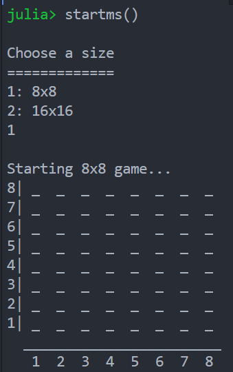
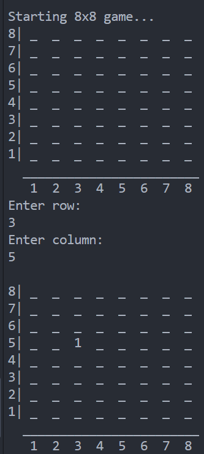
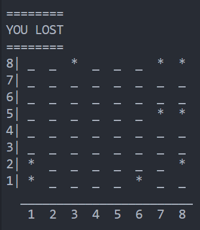
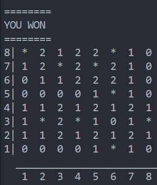

# MineSweeper.jl
A text-based minesweeper game using Julia.
This version only has 2 available game modes: 8x8 and 16x16, but it is
built to support other sizes as well. 

# How to Play 
Minesweeper is a simple puzzle game where the objective is to uncover all of the
tiles with no mines. The game ends either when this is accomplished or the player 
lands  on a mine (represented by an asterisk) More information on how minesweeper 
is played can be found [here](https://www.wikihow.com/Play-Minesweeper). 

## Step 1
Copy all functions into the Julia REPL, then run the ```startms()``` function.
You will be prompted to either choose the 8x8 mode or the 16x16 mdoe. 
Type the number of the mode you want to play and hit enter. 



## Step 2

The player is then shown a blank grid and isprompted to enter the column and row that they want to select. 
Type in what numbers these are and hit ENTER. The new board with the selected tile 
uncovered will be shown.



The player will continue to be prompted to enter in coordinates until they land on a mine or 
uncover all safe tiles.

>Lose screen



>Win screen




TextBasedMinesweeper also utilizes StatsBase.jl
